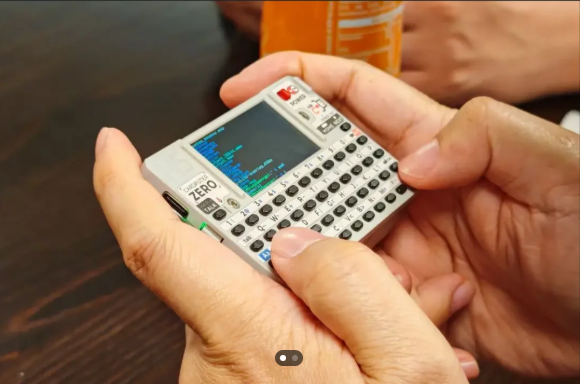

# MicroJS8

<p align="center">
  
</p>

A pocket-sized self-contained JS8 transceiver controller for amateur radio.
Runs on the [M5Stack CardputerZero](https://shop.m5stack.com/pages/m5-cardputerzero)
— a credit-card-sized Linux device built around the Raspberry Pi Compute
Module Zero with a built-in 46-key QWERTY keyboard, a 320×170 LCD, and an
integrated battery. Drives any radio paired with a QRP Labs QDX transceiver
or DigiRig (G90, Baofeng, etc.) — RTS for PTT, USB audio for I/Q.

JS8 is great for low-power messaging but JS8Call wants a full laptop.
This is a headless appliance: power up, navigate the screen ring with the
keyboard arrows, type messages on the built-in keyboard, hold the FN-Q
combo to shut down.

Single keypress (← →) to switch screens, Tab to switch fields within a
screen, ↑ ↓ for dropdown navigation. Same operating model as MiniJS8;
the only operator-facing difference is the wider screen (320×170 vs the
Pi Zero rig's 240×240) which gives more horizontal room for the activity
log and inbox detail views.

## Lineage

MicroJS8 is the CardputerZero realization of the design first prototyped
in [MiniJS8](https://github.com/W5DMH/minijs8). Two years of protocol,
state-machine, and ergonomics work were validated on a Raspberry Pi Zero
2W rig — that codebase, those test suites, and the on-air operating
experience are the foundation MicroJS8 builds on. The screen ring, the
COMPOSE flow, the inbox model, the directed-activity log, the gfsk8
modem integration, the chrony-or-consensus time alignment — all of that
was hammered into shape on MiniJS8. MicroJS8 ports the same code, the
same protocol behaviour, and the same UX to the Cardputer's hardware.

## Hardware

| Component | Notes |
|---|---|
| SBC | M5Stack CardputerZero (Raspberry Pi CM0, 4× Cortex-A53 @ 1 GHz, 512 MB RAM, Debian) |
| Display | Built-in 1.9" 320×170 LCD |
| Keyboard | Built-in 46-key QWERTY (no external USB keyboard needed) |
| Sound + PTT | DigiRig (USB audio + RTS keying) or QDX transceiver |
| Radio | QDX, G90 + DigiRig, Baofeng UV-5R + DigiRig (carryover from MiniJS8 hardware testing) |
| GPS | gpsd-compatible USB receiver — Glonass U-blox 7 recommended |
| Battery | 1500 mAh integrated |

## Screens

Cycle with ← / → arrows on the keyboard:

`HOME · HEARD · DIRECTED · INBOX · COMPOSE · ALLCALL · DIRECTED MENU · EMERGENCY · SETUP`

- **HOME** — basic station info; emergency button starts a beacon every 3 min: `EMERGENCY SEND HELP — GPS LOCATION`
- **HEARD** — recently-heard stations with SNR, distance, bearing
- **DIRECTED** — chat-style activity log (inbound white, outbound red)
- **INBOX** — buffered MSG mailbox (Enter to read, Del to delete)
- **COMPOSE** — TO / CMD (FREE / MSG / STORE / AGN? / SNR? / GRID / QUERY / MYLOC) / TEXT / SEND
- **EMERGENCY** — bypasses unconfigured-station TX lock for life-safety traffic
- **SETUP** — set callsign, grid, units, transceiver, heartbeat TX rate

## Software stack

- Python 3.11 async event loop
- [gfsk8 fork](https://github.com/W5DMH/gfsk8-modem-clean) — JS8 modem core
- SQLite for outbound queue, inbox, and message store
- chrony or multi-frame consensus for slot-time alignment (operator never has to set the clock)

## Status

The CardputerZero hardware is pre-launch (Kickstarter mid-May). MicroJS8
is in active development against the
[CardputerZero AppBuilder emulator](https://github.com/m5stack/CardputerZero-AppBuilder) —
QEMU aarch64 user-mode + an SDL2 window rendering the 320×170 LCD. When
hardware ships, the same `.deb` package will install onto the device
through the built-in APPLauncher.

## Build

The build assumes a fresh CardputerZero-AppBuilder checkout on a Linux
or macOS host. See `build.sh` for the full recipe — it cross-compiles
gfsk8 for aarch64, lays down the systemd unit, packages the Python
package as a `.deb`, and either drops it into the emulator or pushes
to a connected device.

## Test

The Python test suite is host-runnable — no Cardputer hardware or
emulator needed. The audio, display, keyboard, and gfsk8 layers all
have headless stubs. Identical pattern to MiniJS8.

```bash
git clone https://github.com/W5DMH/microjs8.git
cd microjs8
python -m venv .venv
. .venv/bin/activate
pip install -e '.[dev]'
pytest
```

## Project layout

```
src/microjs8/
  app.py                   # asyncio orchestrator
  audio/                   # capture, playback, device discovery
  cat/                     # PTT (RTS / CAT)
  config.py                # /var/microjs8/config.toml
  gps/                     # gpsd reader, grid math
  input/                   # built-in keyboard, router
  modem/                   # encoder + decoder (wraps gfsk8)
  protocol/                # JS8 grammar, callsign parsing
  store/                   # mailbox, message store, retention
  tx/                      # outbound queue, encode worker, scheduler, backend
  ui/                      # display thread, screens, fonts, theme, state
tests/                     # pytest suite (~900 tests carried over from MiniJS8)
build.sh                   # CardputerZero AppBuilder integration recipe
```

## Copyright + License

Copyright © 2025 Donald Hunter, W5DMH

MicroJS8 is free software: you can redistribute it and/or modify it
under the terms of the GNU General Public License version 3 as
published by the Free Software Foundation. See `LICENSE` for the
full text.

GPL-3.0 is the same license as the gfsk8 fork that MicroJS8 depends
on, and the same license as MiniJS8 from which MicroJS8 is derived.

## Acknowledgments

- **JS8Call** by Jordan Sherer KN4CRD — the protocol and the original
  reference implementation. MicroJS8 (via MiniJS8) is a re-target of
  those ideas to embedded hardware, not an independent codebase.
- **gfsk8** — modem core extracted from JS8Call for non-Qt use.
  Original by Jeffrey Francis: https://github.com/jfrancis42/gfsk8-modem-clean
- **MiniJS8** — the Pi Zero 2W proof-of-concept that defined the
  protocol port, screen ring, and operational ergonomics:
  https://github.com/W5DMH/minijs8
- **M5Stack** — for the CardputerZero hardware platform and the
  AppBuilder SDK that makes pocket-Linux JS8 actually feasible.

73 de W5DMH
