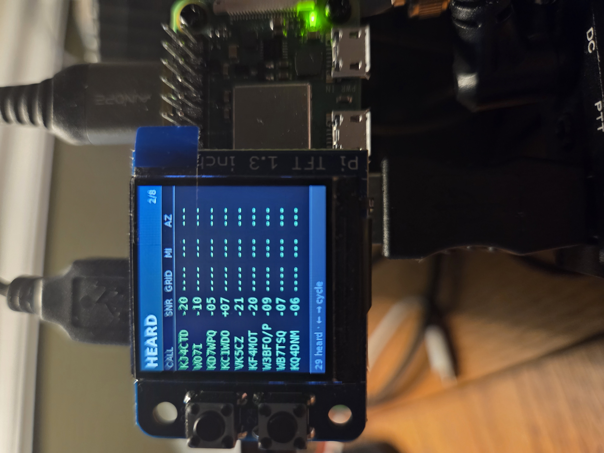
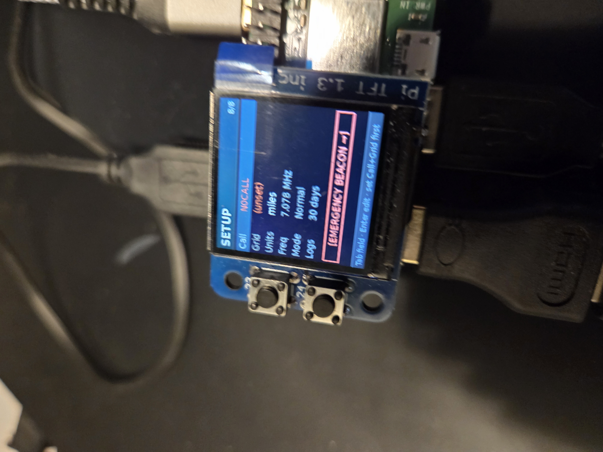

# MiniJS8
<p align="center">
  
  
</p>
A Raspberry Pi Zero 2w complete image https://github.com/W5DMH/minijs8/releases that 
creates a self-contained JS8 transceiver controller for amateur radio. Runs on a
Raspberry Pi Zero 2W with a 240—240 TFT SPI display, two GPIO buttons, and a
USB keyboard. Drives any radio paired with a QRP LABS QDX Transceiver or DigiRig (G90, Baofeng, etc)
RTS for PTT, USB audio for I/Q.

JS8 is great for low-power messaging but JS8Call wants a full laptop.
This is a headless appliance: power up, navigate the screen ring with
arrow keys, type messages with the keyboard, hold both GPIO buttons to
shut down.

Single button touch or keyboard arrows to switch screens, keyboard TAB key to switch fields in a screen and keyboard arrows for navigating drop downs. 

## Hardware

| Component | Notes |
|---|---|
| SBC | Raspberry Pi Zero 2W (Bookworm 64-bit) |
| Display | ST7789 240—240 TFT SPI |
| Sound + PTT | DigiRig (USB audio + RTS keying) OR QDX Transciever |
| Radio | QDX (Tested), G90 w/DigiRig (Tested) Baofeng UV5R w/DigiRig (Tested) |
| GPS | gpsd-compatible Glonass U-blox7 Recommended  |
| Input | USB keyboard, 2— GPIO buttons (backlight / shutdown gesture) |

## Screens

Cycle with > or < Arrow keys on the keyboard:

`HOME | HEARD | DIRECTED | INBOX | COMPOSE |  ALLCALL | DIRECTED MENU | EMERGENCY | SETUP`

- **HOME** basic station info, emergency beacon button starts beacon every 3min "EMERGENCY SEND HELP - GPS LOCATION" 
- **HEARD** recently-heard stations with SNR, distance, bearing
- **DIRECTED** chat-style activity log (inbound white, outbound red)
- **INBOX**  buffered MSG mailbox (Enter to read, Del to delete)
- **COMPOSE** TO / CMD (FREE/MSG/STORE/AGN?/SNR?/GRID/QUERY/MYLOC) / TEXT / SEND
- **EMERGENCY** bypasses unconfigured-station TX lock for life-safety traffic
- **SETUP** Set callsign, grid, units, transceiver, Heartbeat tx rate. 

## Software stack

- Python 3.11 async event loop
- [gfsk8 fork](https://github.com/W5DMH/gfsk8-modem-clean) JS8 modem core (separated from JS8Call's Qt UI)
- SQLite for outbound queue, inbox, and message store
- chrony OR multi-frame consensus for slot-time alignment (operator never has to set the clock)

## Build

See `build.sh` for the image-from-scratch recipe. It assumes a fresh
Raspberry Pi OS Lite Bookworm install on a Pi Zero 2W. The build wires
up the display kernel module, gpsd, the gfsk8 wheel, the systemd unit,
and a default config.

## Test

```bash
git clone https://github.com/W5DMH/minijs8.git
cd minijs8
python -m venv .venv
. .venv/bin/activate
pip install -e '.[dev]'
pytest
```

The test suite is host-runnable — no Pi hardware needed. The audio,
display, GPIO, and gfsk8 layers all have headless stubs.

## Project layout

```
src/minijs8/
  app.py                   # asyncio orchestrator
  audio/                   # capture, playback, device discovery
  cat/                     # PTT (RTS / CAT)
  config.py                # /var/minijs8/config.toml
  gps/                     # gpsd reader, grid math
  input/                   # buttons, keyboard, router
  modem/                   # encoder + decoder (wraps gfsk8)
  protocol/                # JS8 grammar, callsign parsing
  store/                   # mailbox, message store, retention
  tx/                      # outbound queue, encode worker, scheduler, backend
  ui/                      # display thread, screens, fonts, theme, state
tests/                     # pytest suite (~900 tests)
build.sh                   # image build recipe
```

## License

GPL-3.0 matches the gfsk8 fork. See `LICENSE`.

## Acknowledgments

- **JS8Call** by Jordan Sherer KN4CRD — the protocol and the original
  reference implementation. MiniJS8 is a re-target of those ideas to
  embedded hardware, not an independent codebase.
- **GFSK8**  modem core extracted from JS8Call for non-Qt use. https://github.com/jfrancis42/gfsk8-modem-clean


