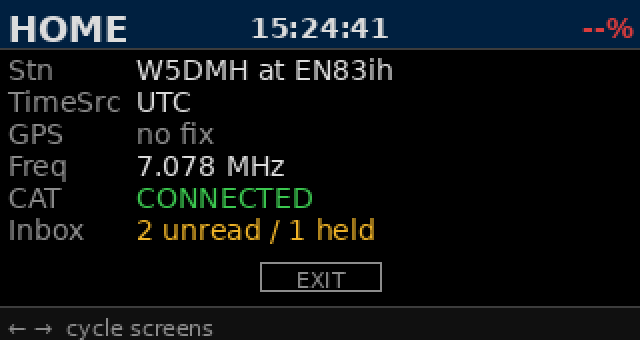
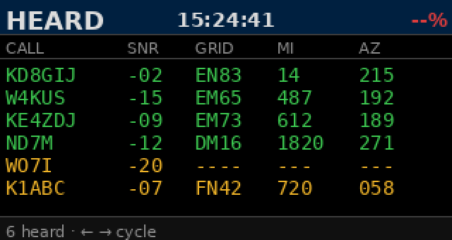
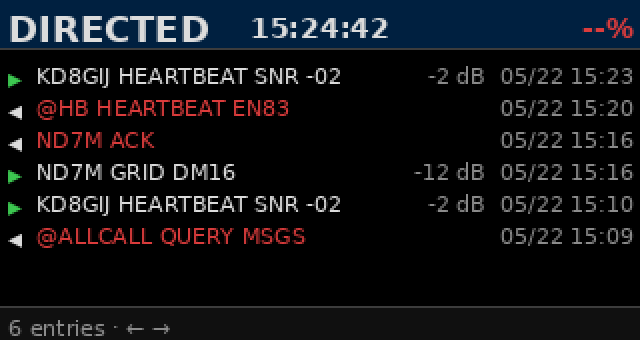
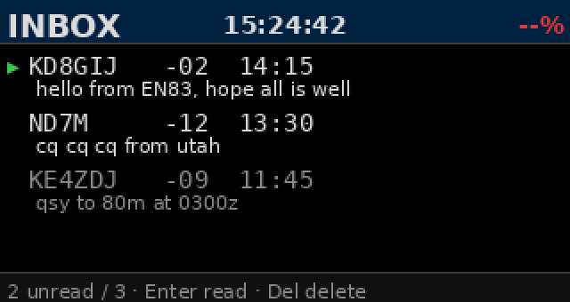
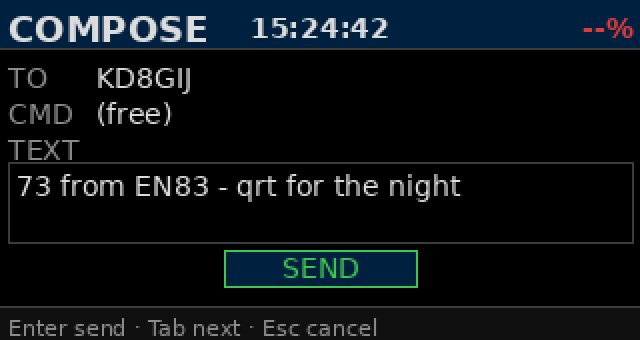
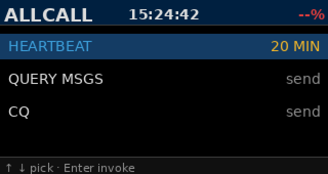
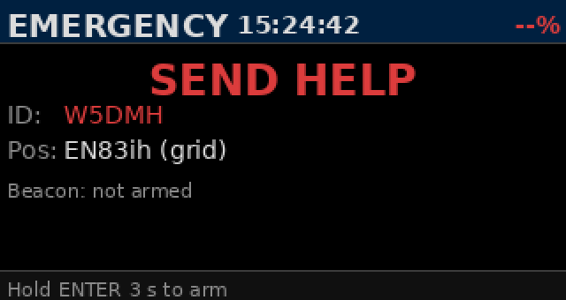
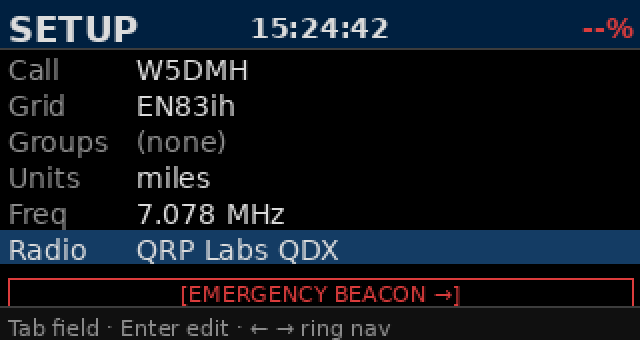
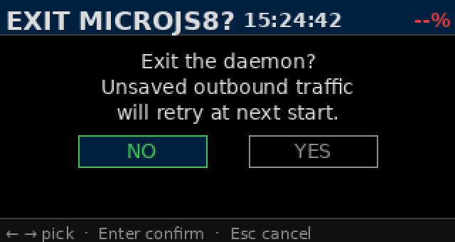

# MicroJS8

<p align="center">
  
</p>

A pocket JS8 transceiver controller for amateur radio. Headless appliance: no JS8Call, no laptop, no Hamlib UI. Power up, navigate the screen ring with the arrow keys, type messages, send. The protocol, modem, timing, and inbox logic are the same ones validated on-air in [MiniJS8](https://github.com/W5DMH/minijs8); MicroJS8 ports them to the 320×170 form factor on two target platforms:

- **M5Stack CardputerZero** — built-in 46-key QWERTY + 1.9″ LCD + integrated battery (pre-launch as of 2026-Q2)
- **Bare Raspberry Pi Zero 2 W + Waveshare 1.9″ 320×170 SPI display** — operator supplies their own USB keyboard. Currently the recommended on-air rig.

Drives a QRP Labs QDX, Xiegu G90 with a DigiRig interface or a DigiRig with "Unknown" RTS keyed radios without CAT control ( Baofeng UV5R, Quansheng, Kenwood handhelds or DL2MAN (tr)Usdx radios) .

---

## Status

- **v0.0.10** — current release. All screens functional, on-air QSO verified on the Pi Zero 2 W rig.
- **v0.0.11** — in pre-release field-test. Hot-fix for the heard-list and minor UX polish.
- CardputerZero hardware ships mid-2026; the same `.deb` installs onto the device through its APPLauncher when it arrives.

---

## Hardware

### Reference rig 1: bare Pi Zero 2 W + Waveshare 320×170

| Component | Part | Notes |
|---|---|---|
| SBC | Raspberry Pi Zero 2 W | Quad Cortex-A53 @ 1 GHz, 512 MB RAM, Bookworm |
| Display | Waveshare 1.9″ 320×170 SPI (ST7789V2) | `fb_st7789v` overlay, /dev/fb1 |
| Keyboard | Any USB HID keyboard | M5Stack CardputerZero keyboard works via USB-C-to-A |
| Transceiver | QRP Labs QDX (primary), Xiegu G90 + DigiRig, Baofeng UV-5R + DigiRig | RTS-PTT via DigiRig, native CAT on QDX |
| GPS | u-blox 7 USB GLONASS dongle | gpsd-managed; auto-fills grid + time |
| USB hub | Powered or unpowered micro-OTG hub | Required to attach radio + GPS + keyboard simultaneously |
| Power | 5 V / ≥ 2 A USB supply or power bank | No internal battery on the bare-Pi rig |

**Display wiring (Waveshare 320×170 → Pi Zero 2 W):**

| Display | Pi pin | BCM GPIO |
|---|---|---|
| VCC | 1 or 17 | 3V3 |
| GND | 6 | GND |
| DIN | 19 | GPIO 10 (MOSI) |
| CLK | 23 | GPIO 11 (SCLK) |
| CS | 24 | GPIO 8 (CE0) |
| DC | 22 | GPIO 25 |
| RST | 13 | GPIO 27 |
| BL | 12 | GPIO 18 |

### Reference rig 2: M5Stack CardputerZero

| Component | Notes |
|---|---|
| SBC | Raspberry Pi CM0, quad Cortex-A53 @ 1 GHz, 512 MB RAM, Debian |
| Display | Built-in 1.9″ 320×170 LCD (same ST7789V2 family as Waveshare above) |
| Keyboard | Built-in 46-key QWERTY (i2c-event device — no external keyboard needed) |
| Battery | Integrated 1500 mAh, BQ27220 fuel gauge |
| Sound + PTT | External via QDX or DigiRig (same as bare-Pi rig) |
| GPS | Same external u-blox 7 |

---

## Installation — bare Pi Zero 2 W + Waveshare 320×170

This is the recommended path while CardputerZero hardware is pre-launch.

### Step 1. Flash + bring up the Pi

Standard Raspberry Pi OS Bookworm Lite, 64-bit. On first boot, get SSH access and update:

```bash
ssh pi@raspberrypi.local
sudo apt update && sudo apt upgrade -y
```

### Step 2. Install the .deb

Download the latest release `.deb` from the [Releases page](https://github.com/W5DMH/microjs8/releases) — it must be the ~3.4 MB file with `gfsk8` bundled. (A bad release of ~240 KB without `gfsk8` is rejected by the build pipeline; if you see one, file an issue.)

Copy to the Pi and install:

```bash
scp microjs8_0.0.10-1_all.deb pi@raspberrypi.local:/tmp/
ssh pi@raspberrypi.local
sudo apt install -y /tmp/microjs8_0.0.10-1_all.deb
```

The postinst script handles everything:

- Creates the `microjs8` system user with the right groups (`audio dialout video i2c input gpio spi`)
- Installs `microjs8-enable-display` — a helper that adds the `fb_st7789v` overlay to `/boot/firmware/config.txt`
- Installs systemd units for `microjs8.service` and `rigctld.service`
- Installs udev rules so the DigiRig appears as `/dev/digirig` regardless of plug order
- Drops `/etc/microjs8/config.toml.default` → `/etc/microjs8/config.toml` (preserves operator edits across upgrades)

### Step 3. Enable the SPI display

```bash
sudo microjs8-enable-display
# Reboot when prompted — needed for the SPI overlay to load
sudo reboot
```

After reboot, confirm the framebuffer exists:

```bash
ls /dev/fb1
cat /proc/fb        # expect 'fb_st7789v' in the output
```

### Step 4. Start the daemon

```bash
sudo systemctl start microjs8.service
sudo systemctl status microjs8.service
```

The display should light up showing the **HOME** screen with `N0CALL` and `(unset)` grid in red — that's the "configure me" state.

### Step 5. Run the doctor

```bash
sudo -u microjs8 /usr/share/APPLaunch/bin/microjs8 --doctor
```

Walk through any red `[FAIL]` lines. On a fresh install you'll see:

- `[WARN]` callsign and grid not set → fix on the SETUP screen
- `[WARN]` audio device → plug in your radio (QDX or DigiRig)
- `[WARN]` GPS → optional; without a GPS dongle, set grid manually

### Step 6. First-run configuration

Press **Tab** to move focus, **Enter** to begin editing, type your value, **Enter** to commit. Set at minimum:

- **Call** — your callsign (e.g. `W5DMH`)
- **Grid** — your 4 or 6-character Maidenhead locator (e.g. `EN83ih`). If you have a GPS dongle this auto-fills.
- **Radio** — Enter to cycle through `QDX`, `G90 + DigiRig`, `Baofeng UV-5R + DigiRig`. The daemon restarts automatically after a radio change.

The `Call` and `Grid` fields turn from red to white once they're valid. Once both are set, the **HOME → EMERGENCY** ring is unblocked for TX.

---

## Installation — CardputerZero

The flow is almost identical to the Pi Zero 2 W rig, with two differences:

- The display is built-in (no Waveshare wiring, no SPI overlay step). The shipped Debian image enables the panel out-of-the-box.
- The keyboard is the integrated 46-key QWERTY on `i2c-event`, no USB keyboard needed.

```bash
ssh pi@cardputerzero.local
sudo apt update && sudo apt upgrade -y
scp microjs8_0.0.10-1_all.deb pi@cardputerzero.local:/tmp/
sudo apt install -y /tmp/microjs8_0.0.10-1_all.deb
sudo systemctl start microjs8.service
```

That's it. The CardputerZero's APPLauncher will also show `MicroJS8` as a tile if you prefer to launch it from the menu rather than as a daemon — pick whichever fits your workflow.

For deep-dive hardware bring-up (capturing Fn-key scancodes, configuring the BQ27220 fuel gauge, etc.) see [docs/HARDWARE_BRINGUP.md](docs/HARDWARE_BRINGUP.md).

---

## Operating

Single keypress (← →) cycles screens. Tab cycles fields within a screen. ↑ ↓ scroll lists or pick dropdown values. Enter commits. Esc cancels.

### Screen ring

```
HOME ↔ HEARD ↔ DIRECTED ↔ INBOX ↔ COMPOSE ↔ ALLCALL ↔ EMERGENCY ↔ SETUP
                                                       (modal: EXIT confirm)
```

### HOME — station status

<p align="center"></p>

At-a-glance station status. Banner shows screen name + UTC clock + battery. Body rows:

- **Stn** — callsign and grid. Red text if either is unconfigured.
- **TimeSrc** — `UTC` (chrony-synced from GPS or NTP) / `CONSENSUS` (radio-derived median-dt fallback) / `---` (no sync, TX blocked).
- **GPS** — `no fix` / fix details.
- **Freq** — current radio frequency (CAT-reported).
- **CAT** — `CONNECTED` / `--`.
- **Inbox** — only shows when unread mail OR mail held for others is present.

The **EXIT** button slim-mounts at the bottom. Enter opens a confirmation modal (see below).

### HEARD — recently-heard stations

<p align="center"></p>

Stations decoded in the last few hours, most-recent at top. Columns: callsign, SNR (dB), 4-char grid, distance (mi or km from your grid), bearing (azimuth degrees from your grid). Row color = freshness: green ≤ 30 min, yellow 30 min – 4 h, gray > 4 h.

**↑ ↓** scrolls. Footer shows `↑ N · ↓ M` so you know whether there are more rows above or below the visible window. Stations from the **Directed** activity log appear here too — anyone you've exchanged frames with becomes a Compose-TO candidate.

### DIRECTED — protocol activity log

<p align="center"></p>

Chat-style log of protocol-level exchanges with named stations: heartbeats, SNR?, GRID, QUERY MSGS, ACKs. Newest at top. Chevron color tells direction:

- `▸ green` — inbound. Meta column shows SNR + `MM/DD HH:MM` UTC.
- `◂ red` — outbound (you). Meta column shows timestamp.

MSG / MSG TO: mail bodies do NOT show here — those go to **INBOX**. This screen is the surrounding protocol traffic, not the inbox content.

**↑ ↓** scrolls. Triggering an ALLCALL action (Heartbeat / QUERY MSGS / CQ) automatically jumps here so you can confirm the broadcast went out.

### INBOX — buffered mail

<p align="center"></p>

The JS8 mailbox. Two row types:

- **UNREAD / READ** — mail addressed to your station. Bold + green chevron when unread.
- **STORE** — mail you're holding to deliver to someone else's `QUERY MSGS`. Shown in amber with a `→<recipient>` tag.

**↑ ↓** moves focus. **Enter** opens detail-view and marks the row READ. **Del** deletes the focused row. Footer summary: `<unread> / <total>`.

### COMPOSE — send a message

<p align="center"></p>

Four fields: **TO** (callsign or `@group`), **CMD** (the JS8 verb), **TEXT** (the body), **SEND**. TO auto-populates from the Heard list on entry; ↑/↓ cycles through Heard callsigns + configured `@groups`.

CMD options:

- `(free)` — plain directed message
- `MSG` — protocol mail to a station's inbox (CRC, ACK round-trip)
- `STORE` — local mailbox write (no TX; you're staging mail for later)
- `MSG TO:` — hold mail for a third party (adds a `FOR` field)
- `AGN?`, `SNR?`, `GRID`, `QUERY MSGS`, `QUERY MSG <id>`, `MYLOC`, `ACK`

Tab moves between fields. Enter on **SEND** transmits. Esc clears and returns to the previous screen.

The footer right-hand side shows TX-state warnings: `TO callsign required`, `TX OFF — battery critical`, `queued — awaiting time sync`, etc. — color-coded yellow so you see why SEND won't fire.

### ALLCALL — group broadcasts

<p align="center"></p>

Three rows for broadcast actions:

- **HEARTBEAT** — set the @HB beacon schedule: `OFF` / `SINGLE` (one shot) / `20 MIN` / `1 HR`
- **QUERY MSGS** — broadcasts `@ALLCALL QUERY MSGS`; any station holding mail for you replies on the next slot
- **CQ** — broadcasts `CQ CQ CQ <your-grid>`

Enter on a firing action jumps to DIRECTED so you see the outgoing entry land in the log.

### EMERGENCY — life-safety beacon

<p align="center"></p>

One-press SOS for non-radio users. Hold **Enter** for 3 seconds to arm. Once armed, fires `EMERGENCY SEND HELP — GPS LOCATION` every 3 minutes until canceled.

EMERGENCY bypasses the unconfigured-station lock (will TX even if Callsign / Grid aren't set) and the battery-critical cutoff (life safety overrides power conservation). It is a deliberate design choice that a panicked non-operator can fall into this screen and trigger help with zero prior knowledge.

### SETUP — configuration

<p align="center"></p>

Six configurable rows + Emergency-beacon access button:

- **Call**, **Grid** — your station identity (Tab to focus, Enter to edit, type, Enter to save)
- **Groups** — comma-separated `@group` memberships (e.g. `@ARESGA,@WEATHER`)
- **Units** — `miles` / `km` for the Heard list distance column
- **Freq** — radio frequency (commits via CAT to the radio)
- **Radio** — Enter cycles through supported radios: `QRP Labs QDX` / `Xiegu G90 + DigiRig` / `Baofeng UV-5R + DigiRig`. The daemon auto-restarts to load the new profile.

The **EMERGENCY BEACON** button at the bottom is the same as cycling to the EMERGENCY screen via the ring.

### EXIT confirmation modal

<p align="center"></p>

Enter on the HOME → EXIT button opens this modal. **NO** is focused by default; ←/→ moves between NO and YES; Enter on YES exits the daemon cleanly, Enter on NO or Esc returns to HOME. Prevents accidental exits from stray Enter keypresses.

---

## Daily operation

### Starting / stopping

```bash
sudo systemctl start microjs8.service       # start
sudo systemctl stop microjs8.service        # stop
sudo systemctl status microjs8.service      # status
journalctl -fu microjs8.service             # follow the journal
```

The systemd unit uses `Restart=on-failure` with `RestartForceExitStatus=75` — switching the radio in SETUP exits with code 75, systemd brings it back up within ~5 seconds with the new radio profile loaded.

### Configuration file

`/etc/microjs8/config.toml`. Edits via SETUP write here. Preserved across `.deb` upgrades.

### Logs

Everything goes to journald under the `microjs8.service` unit. Filter with `journalctl -u microjs8 --since '1 hour ago'`. Operator-relevant lines are at `INFO`; protocol decodes log at `INFO` too so you can replay an exchange from the journal alone.

### Updates

```bash
scp microjs8_<new-version>-1_all.deb pi@host:/tmp/
ssh pi@host
sudo apt install -y /tmp/microjs8_<new>-1_all.deb     # drop-in upgrade
sudo systemctl restart microjs8.service
```

The postinst preserves `config.toml`, inbox database, and message store across upgrades.

---

## Troubleshooting

### Doctor first

```bash
sudo -u microjs8 /usr/share/APPLaunch/bin/microjs8 --doctor
```

Every subsystem reports its own status. The doctor is the canonical "is everything wired up" check.

### Common issues

**Daemon won't start, "ModuleNotFoundError: No module named 'gfsk8'"**
The installed `.deb` was built without bundled gfsk8. Re-download the release — it should be ~3.4 MB. If your local `.deb` is ~240 KB, the size guard in `scripts/build_deb.py` would have caught this; re-download from GitHub Releases.

**Display stays black**
Confirm `/dev/fb1` exists (`ls /dev/fb1`). If missing, run `sudo microjs8-enable-display` and reboot. Confirm the Waveshare wiring against the table above. `dmesg | grep -i st7789` will show any driver errors.

**No CAT connection**
The radio must enumerate as `/dev/digirig` (for DigiRig-driven setups) or `/dev/ttyUSB0` (QDX). Confirm with `ls -la /dev/digirig /dev/ttyUSB*`. The udev rule installed by the `.deb` symlinks the DigiRig device regardless of plug-in order, but you do need to plug the radio in BEFORE starting the service for the auto-detect to find it.

**TX blocked: "queued — awaiting time sync"**
The scheduler refuses to TX without an established time source. Confirm `chrony` is running (`systemctl status chrony`) or wait for the radio-derived consensus voter to pick up at least 3 decoded frames (~45 s of decodes). The COMPOSE screen's footer warning tracks this.

**Keyboard not responsive**
Confirm your USB keyboard appears in `evtest` or `/proc/bus/input/devices`. If you're on the bare-Pi rig and using a USB keyboard, you may need to add `microjs8` to the `input` group (the postinst should have done this) — `groups microjs8` to confirm.

### Reset

```bash
sudo systemctl stop microjs8.service
sudo rm -rf /var/lib/microjs8/*       # nukes inbox.db + message_store.db
sudo cp /etc/microjs8/config.toml.default /etc/microjs8/config.toml
sudo systemctl start microjs8.service
```

This wipes inbox, message log, and reverts config to defaults. Operator identity (callsign, grid) is in `config.toml` — restore from a backup if you have one, otherwise re-enter on SETUP.

---

## Build from source

The Python suite is host-runnable. No Pi hardware needed for development:

```bash
git clone https://github.com/W5DMH/microjs8.git
cd microjs8
python3 -m venv .venv
. .venv/bin/activate
pip install -e '.[dev]'
pytest        # ~1500 tests, runs in ~1 min
```

### Building the .deb

Building a shippable `.deb` requires the gfsk8 modem source. Build it first per its [README](https://github.com/W5DMH/gfsk8-modem-clean), then point the packager at the resulting `.so`:

```bash
python3 scripts/build_deb.py --output-dir dist \
    --gfsk8-so /path/to/gfsk8.cpython-311-aarch64-linux-gnu.so
```

The output `.deb` should be ~3.4 MB. If it's < 1 MB the build is refused (size guard) — that means gfsk8 wasn't bundled. Either provide the correct `--gfsk8-so` path, or if you actually want a `gfsk8`-less build (e.g. for CI), pass `--allow-no-gfsk8`.

### Project layout

```
src/microjs8/
  app.py                   # asyncio orchestrator
  activity.py              # directed-activity log (DirectedActivityLog)
  audio/                   # capture, playback, device discovery
  cat/                     # PTT (RTS / CAT) — radio profiles in cat/radios/
  config.py                # /etc/microjs8/config.toml schema
  gps/                     # gpsd reader, Maidenhead grid math
  input/                   # USB / i2c-event keyboard, screen-ring router
  modem/                   # encoder + decoder (wraps gfsk8)
  power/                   # battery (BQ27220) + backlight
  protocol/                # JS8 grammar, parser, reassembly
  store/                   # mailbox, message store, retention
  tx/                      # outbound queue, encode worker, scheduler, beacons
  ui/                      # display thread, screens, fonts, theme, state
tests/                     # pytest suite — runs on any Linux host
scripts/build_deb.py       # .deb packager
.github/workflows/         # CI lint / structure check (no shippable .deb)
```

---

## Lineage

MicroJS8 is the CardputerZero realization of the design first prototyped in [MiniJS8](https://github.com/W5DMH/minijs8). Two years of protocol, state-machine, and ergonomics work were validated on a Raspberry Pi Zero 2W rig — that codebase, those test suites, and the on-air operating experience are the foundation MicroJS8 builds on. The screen ring, the COMPOSE flow, the inbox model, the directed-activity log, the gfsk8 modem integration, the chrony-or-consensus time alignment — all of that was hammered into shape on MiniJS8. MicroJS8 ports the same code, the same protocol behaviour, and the same UX to the wider 320×170 display form factor.

---

## Copyright + License

Copyright © 2025-2026 Daniel Hurd, W5DMH

MicroJS8 is free software: you can redistribute it and/or modify it under the terms of the GNU General Public License version 3 as published by the Free Software Foundation. See `LICENSE` for the full text.

GPL-3.0 is the same license as the gfsk8 fork MicroJS8 depends on, and the same license as MiniJS8 from which MicroJS8 is derived.

## Acknowledgments

- **JS8Call** by Jordan Sherer KN4CRD — the protocol and the original reference implementation. MicroJS8 is a re-target of those ideas to embedded hardware, not an independent codebase.
- **gfsk8** — modem core extracted from JS8Call for non-Qt use. Original by Jeffrey Francis: https://github.com/jfrancis42/gfsk8-modem-clean
- **MiniJS8** — the Pi Zero 2W proof-of-concept that defined the protocol port, screen ring, and operational ergonomics: https://github.com/W5DMH/minijs8
- **Waveshare** — for the affordable 1.9″ 320×170 SPI panel that makes the bare-Pi rig possible.
- **M5Stack** — for the CardputerZero hardware platform and the AppBuilder SDK that makes pocket-Linux JS8 actually feasible.
